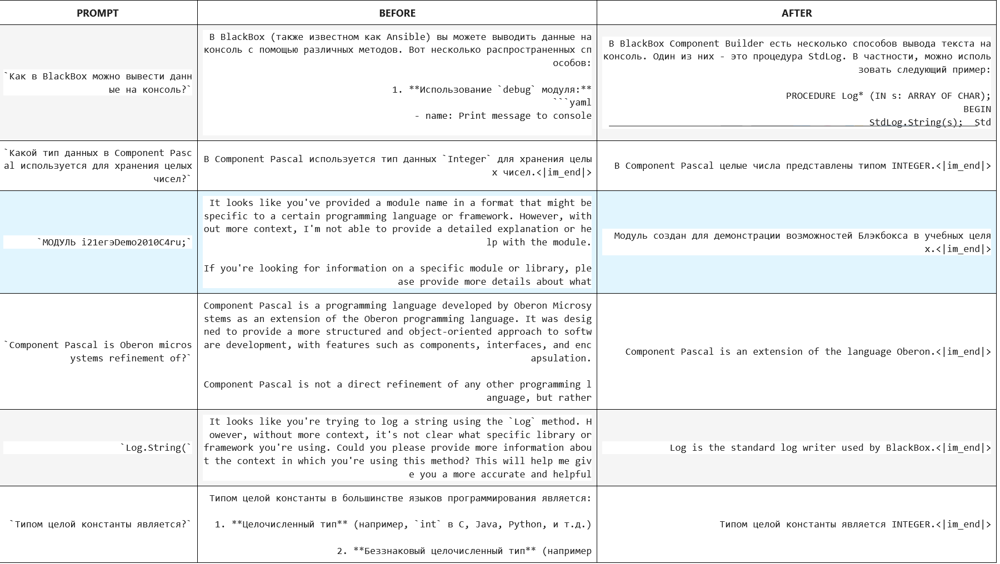
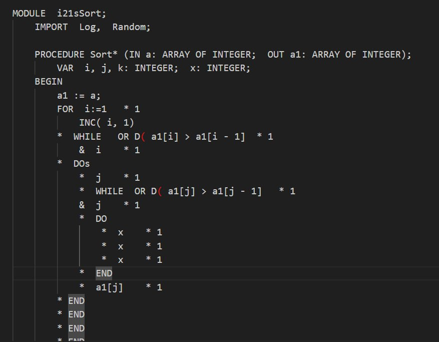
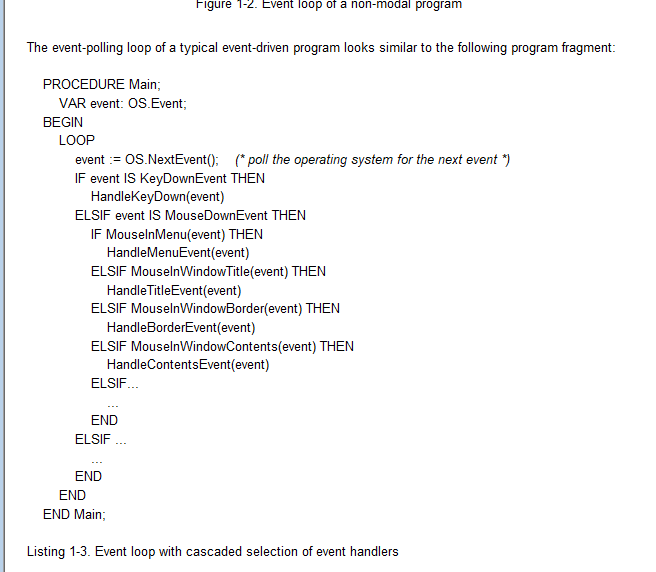

# Обучение нейросети с помощью SFT и RLHF

## Автор: Антон Шелин

---

## Введение

Экзаменационная работа по курсу "Построй свой ChatGPT".

---

## Цель

Обучить нейросеть Copilot для небольшой системы программирования BlackBox и языка Component Pascal.

---

## Проблема

Существующие модели путают Component Pascal с другими языками, такими как Delphi и Pascal, а также ничего не знают про систему BlackBox.

> Сегодня перепроверил большие модели Deepseek и Mistral large, они уже знают про Component Pascal, но все еще путают его с Oberon. Это уже ближе. Но код некорректный.

---

## Набор датасетов

1. Написан crawler для сбора данных с форума, посвященного этому ЯП и системе.
2. Экспортирован чат из Telegram.
3. Взята вся документация и код из системы, сконвертированы в txt формат.
4. скачиваем pdf site:https://people.inf.ethz.ch/ filetype:pdf
5. конвертация в markdown с помощью surja
6. На основе документации и кода, с помощью модели Qwen-coder2.5 сгенерирован набор пар вопрос-ответ.

---

## Базовая модель

1. Приоритет на маленькие модели 1.5B или 3B, максимум 7B.
2. Бейзлайн модель Cotype Nano(хорошие результаты в бенчмарках, но неустойчива к изменению настроек). После sft работала, но крайне неустойчиво.
3. Попытка 2: Qwen Coder 2.5 Instruct 3B. Достаточно мала и в тоже время показала хорошие результаты.
4. TODO Qwen Coder 2.5 7B

---

## Обучение документация и код

Обучение на файлах документации и кода.
Токенезация: перекрывающиеся куски длиной 512 токенов и перекрытие 32 токена

Проблема: переобучение и бесконечная генерация.
Решение: увеличение дропаута и снижение скорости обучения, раннее прерывание, добавление стоп токена к текстам.

После правок, модель стала давать осмысленные и корректные ответы.

---

---

## Генерация QA
Модель генератор часто генерировала некорректный json, например не экранировала строки.
Пришлось разбираться со структурным выводом.

---
## Обучение QA

Обучение на вопросах ответах было проведено с помощью чат темплейтов.

Результаты стали хуже:
1. Переобучение
2. Неверные обобщения в сгенерированных вопросах и ответах

Изменения:

1. Генерировать пары с указанием ширины контекста(модуль, весь фреймворк, яп)
2. Генерировать пары только на более общей документации.
3. уменьшить скорость обучения
---

## Проблемы

Модель все еще генерирует код который не компилируется.

Но у нас же есть ГРАММАТИКИ. GBNF в llama.cpp!!!

---

## Грамматика

### Проблемы
1. К сожалению не работает. Модель умудряется генерировать грамматически валидный мусор.
2. Имеются проблемы с производительностью.
3. Необходимо конвертировать старые EBNF в GBNF. (написал конвертер)

Для полного контроля надо

1. однопроходный компилятор
2. соответствие токенов в токенизаторах LLM и компилятора
3. вклинить logits prccessor

---

---

## RLHF

### TODO

Модель все еще генерирует код который не компилируется.
Вытащить из обучающих материалов задачу и правильный ответ, сгенерировать ответы нейронкой и прогнать через компилятор, если не компилируется то выставить их как негативный ответ.
Обучить reward и прогнать через trl

---
## Инфраструктура

1. ллм хостинг vllm(получилось хостить qlora в параллель с квантизованной моделью)
2. фронтенд web assembly bootstrap
3. бекенд web sockets asp.net core
4. хранение чатов PG + pgvector для RAG
5. телеграм бот [@blackbox_cp_helper_bot](https://t.me/blackbox_cp_helper_bot)
6. добавлены метрики TTFT...
---

## Проблема выделения кода

Модель не выделяет куски кода с помощью markdown. В обучающем корпусе все является текстом и код и описание, нет выделения.

1. Промпт инжениринг. Добавлен системный промпт с попыткой заставить модель генерить правильный ответ. Не всегда работает. :-(
2. Пытался обучить Обучить BERT модель как токен классификатор и классификатор строк на датасете, не успешно, надо размечать все руками. С помощью эвристик не вышло.
3. Успешно получилось с помощью Qwen Coder 2.5 7B преобразовывать тексты в маркдаун, модель хоть и делает ошибки но их мало и они легко устранимы. Медленно.
4. Написан парсер на основе EBNF грамматики языка. Реализована разметка кода. К сожалению тоже дает ошибки.

---

## Лучшее решение выделения кода

### Мультимодальные LLM

Видят выделение кода с помощью шрифта и отступов. Также выделяют таблицы и диаграммы.

---

## Проблема с ollama

Если сравнивать вывод ollama модели gguf и модели с vllm, на глаз видно лучшее качество оригинальной модели. Видимо в процессе квантизации или мерджа веса искажаются и на малом размере модели дают снижение качества.
Особенно это было видно на модели 1.5B. Надо будет проверить замену QLoRa на Lora или взять модель побольше размером, 7B.

---

### Планы

1. Добавить в BlackBox возможность работать с моделью через ollama или openai ендпоинт.
2. Обучить другие модели.
3. Собрать более широкий/качественный датасет из учебников, книг, научных статей, использовать как помощника исследователя по CS
4. Улучшить пайплайн обучения. Прочитать больше статей по теме, например [Textbooks Are All You Need](https://arxiv.org/abs/2306.11644)
4. Сделать проверку метрик для разных версий модели/бенчмарк

---

## Заключение

С помощью SFT была получена модель, которая понимает новый домен и генерирует осмысленные ответы по языку Component Pascal и системе BlackBox. Также была создана инфраструктура для использования модели.
Модель и датасет были опубликованы на hugginface и ollama. Возможно использовать ее локально для работы. Модель понимает новый домен и дает осмысленные ответы, в то время как базовая модель этот домен не знает.
Цель генерации корректного кода пока не достигнута(для сложных задач).

---

## Вопросы и ответы

Спасибо за внимание!

